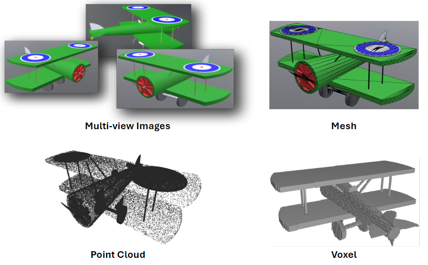

# 3D-Object-Retrieval-Methods-Bibliography
Welcome to the 3D Object Retrieval Methods Bibliography repository. This repository aims to provide a comprehensive and organized bibliography of the state-of-the-art methods in 3D object retrieval. We categorize the methods into three main approaches: unimodal, cross-modal, and multimodal. Each category includes various methods based on specific modalities including multi-view images, meshes, voxels, and point clouds.

    

## Categories

### Unimodal Retrieval Methods
Unimodal retrieval methods focus on a single modality for retrieving 3D objects. This category encompasses techniques that utilize:

- **Multi-view images**: Methods that leverage multiple 2D views of a 3D object.
1. Johns, E., Leutenegger, S., & Davison, A. J. (2016). Pairwise decomposition of image sequences for active multi-view recognition. In Proceedings of the IEEE Conference on Computer Vision and Pattern Recognition (CVPR) (pp. 3813-3822).
2. Qi, C. R., Su, H., Nießner, M., Dai, A., Yan, M., & Guibas, L. J. (2016). Volumetric and multi-view cnns for object classification on 3d data. In Proceedings of the IEEE Conference on Computer Vision and Pattern Recognition (CVPR) (pp. 5648-5656).
3. Wang, C., Pelillo, M., & Siddiqi, K. (2019). Dominant set clustering and pooling for multi-view 3D object recognition. arXiv preprint arXiv:1906.01592.
4. Zanuttigh, P., & Minto, L. (2017). Deep learning for 3D shape classification from multiple depth maps. In 2017 IEEE International Conference on Image Processing (ICIP) (pp. 3615-3619).
5. Feng, Y., Zhang, Z., Zhao, X., Ji, R., & Gao, Y. (2018). Gvcnn: Group-view convolutional neural networks for 3D shape recognition. In Proceedings of the IEEE Conference on Computer Vision and Pattern Recognition (CVPR) (pp. 264-272).
6. He, X., Zhou, Y., Zhou, Z., Bai, S., & Bai, X. (2018). Triplet-center loss for multi-view 3D object retrieval. In Proceedings of the IEEE Conference on Computer Vision and Pattern Recognition (CVPR) (pp. 1945-1954).
7. Kanezaki, A., Matsushita, Y., & Nishida, Y. (2018). Rotationnet: Joint object categorization and pose estimation using multiviews from unsupervised viewpoints. In Proceedings of the IEEE Conference on Computer Vision and Pattern Recognition (CVPR) (pp. 5010-5019).
8. Jiang, J., Bao, D., Chen, Z., Zhao, X., & Gao, Y. (2019). MLVCNN: Multi-loop-view convolutional neural network for 3D shape retrieval. In Proceedings of the AAAI Conference on Artificial Intelligence (AAAI) (Vol. 33, No. 01, pp. 8513-8520).
9. Wang, C., Wang, X., Bai, X., Liu, Y., & Zhou, J. (2019). Self-supervised deep homography estimation with invertibility constraints. Pattern Recognition Letters, 128, 355-360.

- **Meshes**: Methods that use the polygonal representation of 3D objects.
1. Chen, D. Y., Tian, X. P., Shen, Y. T., & Ouhyoung, M. (2003). On visual similarity based 3D model retrieval. In Computer graphics forum (Vol. 22, No. 3, pp. 223-232). Oxford, UK: Blackwell Publishing, Inc.
2. Kazhdan, M., Funkhouser, T., & Rusinkiewicz, S. (2003). Rotation invariant spherical harmonic representation of 3D shape descriptors. In Symposium on Geometry Processing (Vol. 6, pp. 156-164).
3. Feng, Y., Feng, Y., You, H., Zhao, X., & Gao, Y. (2019). MeshNet: Mesh neural network for 3D shape representation. In Proceedings of the AAAI Conference on Artificial Intelligence (AAAI) (Vol. 33, No. 01, pp. 8279-8286).
4. Hanocka, R., Hertz, A., Fish, N., Giryes, R., Fleishman, S., & Cohen-Or, D. (2019). MeshCNN: a network with an edge. ACM Transactions on Graphics (ToG), 38(4), 1-12.

- **Point clouds**: Methods that utilize sets of points in space to represent 3D objects.
1. Ravanbakhsh, S., Schneider, J., & Poczos, B. (2016). Deep learning with sets and point clouds. arXiv preprint arXiv:1611.04500.
2. Zaheer, M., Kottur, S., Ravanbakhsh, S., Poczos, B., Salakhutdinov, R. R., & Smola, A. J. (2017). Deep sets. Advances in Neural Information Processing Systems, 30.
3. Qi, C. R., Su, H., Mo, K., & Guibas, L. J. (2017). PointNet: Deep learning on point sets for 3D classification and segmentation. In Proceedings of the IEEE Conference on Computer Vision and Pattern Recognition (CVPR) (pp. 652-660).
4. Klokov, R., & Lempitsky, V. (2017). Escape from cells: Deep kd-networks for the recognition of 3D point cloud models. In Proceedings of the IEEE Conference on Computer Vision and Pattern Recognition (CVPR) (pp. 863-872).
5. Yang, Y., Feng, C., Shen, Y., & Tian, D. (2018). FoldingNet: Point cloud auto-encoder via deep grid deformation. In Proceedings of the IEEE Conference on Computer Vision and Pattern Recognition (CVPR) (pp. 206-215).
6. Liu, Y., Fan, B., Xiang, S., & Pan, C. (2019). Relation-shape convolutional neural network for point cloud analysis. In Proceedings of the IEEE/CVF Conference on Computer Vision and Pattern Recognition (CVPR) (pp. 8895-8904).
7. Wang, Y., Sun, Y., Liu, Z., Sarma, S. E., Bronstein, M. M., & Solomon, J. M. (2019). Dynamic graph CNN for learning on point clouds. ACM Transactions on Graphics (TOG), 38(5), 1-12.

- **Voxels**: Methods based on volumetric representation of 3D data.
1. Fanelli, G., Weise, T., Gall, J., & Van Gool, L. (2011). Real time head pose estimation from consumer depth cameras. In Joint Pattern Recognition Symposium (pp. 101-110). Berlin, Heidelberg: Springer Berlin Heidelberg.
2. Maturana, D., & Scherer, S. (2015). Voxnet: A 3D convolutional neural network for real-time object recognition. In 2015 IEEE/RSJ International Conference on Intelligent Robots and Systems (IROS) (pp. 922-928).
3. Wu, Z., Song, S., Khosla, A., Yu, F., Zhang, L., Tang, X., & Xiao, J. (2015). 3D shapenets: A deep representation for volumetric shapes. In Proceedings of the IEEE Conference on Computer Vision and Pattern Recognition (CVPR) (pp. 1912-1920).
4. Xu, X., & Todorovic, S. (2016). Beam search for learning a deep convolutional neural network of 3D shapes. In 2016 23rd International Conference on Pattern Recognition (ICPR) (pp. 3506-3511).

### Cross-Modal Retrieval Methods
Cross-modal retrieval methods aim to bridge different modalities for 3D object retrieval. For example, these methods might retrieve 3D objects using 2D images as queries. This category highlights techniques that integrate information across different types of data to enhance retrieval performance.
1. Jing, L., Vahdani, E., Tan, J., & Tian, Y. (2021). Cross-modal center loss for 3D cross-modal retrieval. In Proceedings of the IEEE/CVF Conference on Computer Vision and Pattern Recognition (CVPR) (pp. 3142-3151).
2. Lin, M. X., Yang, J., Wang, H., Lai, Y. K., Jia, R., Zhao, B., & Gao, L. (2021). Single image 3S shape retrieval via cross-modal instance and category contrastive learning. In Proceedings of the IEEE/CVF International Conference on Computer Vision (pp. 11405-11415).

### Multimodal Retrieval Methods
Multimodal retrieval methods combine multiple modalities simultaneously to improve the accuracy and robustness of 3D object retrieval. These methods integrate data from various sources such as images, and 3D representations to provide a more comprehensive retrieval system.
1. Nie, W., Liang, Q., Wang, Y., Wei, X., & Su, Y. (2020). MMFN: Multimodal information fusion networks for 3D model classification and retrieval. ACM Transactions on Multimedia Computing, Communications, and Applications (TOMM), 16(4), 1-22.
2. Lin, D., Cheng, Y., Guo, A., Mao, S., & Li, Y. (2024). SCA-PVNet: Self-and-cross attention based aggregation of point cloud and multi-view for 3D object retrieval. Knowledge-Based Systems, 111920.
3. Pegia, M., Jónsson, B. Þ., Moumtzidou, A., Diplaris, S., Gialampoukidis, I., Vrochidis, S., & Kompatsiaris, I. (2024). Multimodal 3D Object Retrieval. In International Conference on Multimedia Modeling (MMM) (pp. 188-201). Cham: Springer Nature Switzerland.

## Goals
Our primary goals for this repository are to:
- Organize and document the current state-of-the-art methods in 3D object retrieval.
- Include both historical and contemporary methods to provide a broad perspective on the development of the field.
- List and describe benchmark datasets commonly used for evaluating 3D object retrieval methods.

## Benchmark Datasets
In addition to documenting retrieval methods, we provide information on benchmark datasets that are widely used in this domain. These datasets are crucial for the evaluation and comparison of different retrieval approaches.

| Dataset Name               | Description                                         |Size  | Labels | Modalities          | Link                                    |
|----------------------------|---------------------------------------------------  |------| ------|  ------------------ | -----------------------------------------|
| ModelNet10                  | Large-scale 3D CAD model dataset | 4,899 |  10     | Image, Mesh, Point Cloud  | [Link](https://modelnet.cs.princeton.edu/# ) |
| ModelNet40                  | Large-scale 3D CAD model dataset | 12,311     |  40    |  Image, Mesh, Point Cloud  | [Link](https://modelnet.cs.princeton.edu/# )    |
| ShapeNetCore                | Richly-annotated large-scale repository of 3D models | 31,854 |   48    |  Image, Mesh, Point Cloud  | [Link](https://huggingface.co/datasets/ShapeNet/ShapeNetCore)    |
| BuildingNet_v0 | Large-scale dataset of annotated 3D building models        | 2,000 |  60  | Image, Mesh, Point Cloud | [Link](https://github.com/buildingnet/buildingnet_dataset?tab=readme-ov-file) |
| XRECO.Buildings.Monuments​ | 3D models created with photogrammetry of monuments and buildings mainly across Europe        |  201 |  12  | Image, Mesh | [Link](https://zenodo.org/records/10809451 ) |

## How to Contribute
We strongly encourage the community to provide contributions through pull requests!

Thank you for visiting our repository. We hope this resource helps researchers, students, and practitioners navigate the rich and evolving field of 3D object retrieval.

# Contact
- Maria Pegia (mpegia@iti.gr)
- Stamatis Samaras (sstamatis@iti.gr)
- Sotiris Diplaris (diplaris@iti.gr)
- Stefanos Vrochidis (stefanos@iti.gr)

# Acknowledgements
This work was supported by the Horizon research and innovation programme under grant agreement HE-101070250 XRECO.

  
